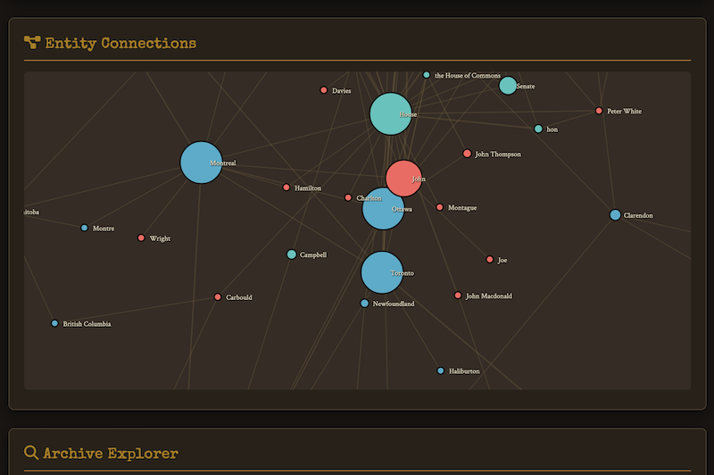
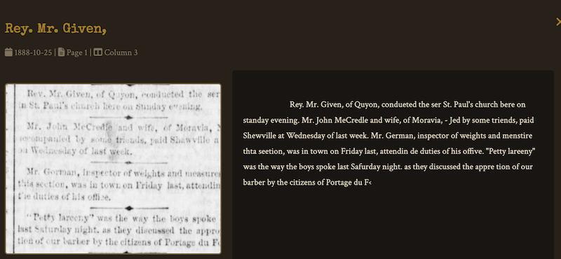
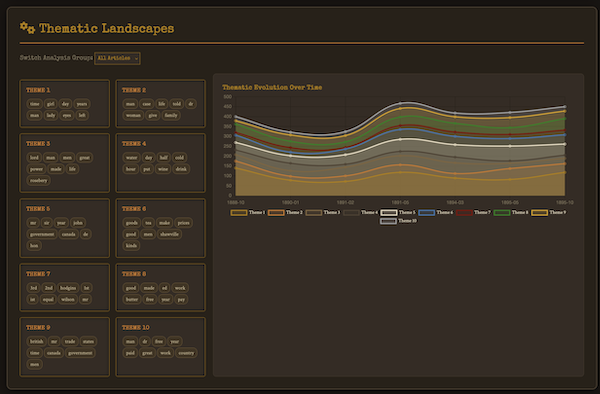
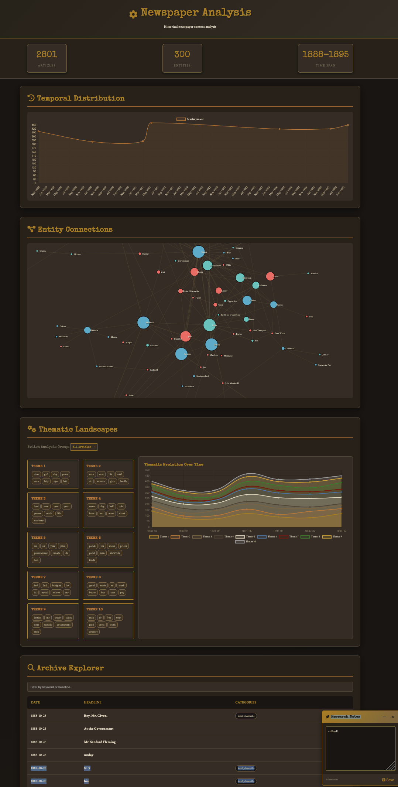

# Newspaper Utilities

A configurable pipeline for OCR'ing, analyzing, and visualizing historical newspapers. Extract entities, build networks, analyze text, and generate interactive dashboards - all customizable through YAML configuration files.

[Inspired by a conversation about Jack the Ripper](https://electricarchaeology.ca/2026/01/14/futzing-with-newspaper-ocr/)

## Features

- **OCR Processing**: Multiple OCR engines (Tesseract, PaddleOCR, Surya, Google Gemini, ocrmac)
- **Article Segmentation**: Automatic detection of article boundaries
- **Configurable Tagging**: Define your own research topics and keywords
- **Timeline Analysis**: Correlate local publications with reference events
- **Text Analysis**: Comparative linguistics and sensationalism metrics
- **Entity Extraction**: Extract people, places, organizations with normalization
- **Network Analysis**: Co-occurrence networks, temporal analysis, community detection
- **Interactive Dashboard**: Single-page HTML dashboard with D3.js visualizations



## Quick Start

### Installation

```bash
git clone https://github.com/XLabCU/newspaper_utilities.git
cd newspaper_utilities
pip install -r scripts/requirements.txt

# For spaCy entity extraction
python -m spacy download en_core_web_sm

# Install system dependencies
apt-get install -y poppler-utils tesseract-ocr
```

### Basic Usage

1. Place your PDF files in the `pdfs/` folder
2. Run the complete pipeline:

```bash
python scripts/run_pipeline.py
```

This will:
- Preprocess PDFs to high-quality image snippets
- Run OCR (default: Tesseract)
- Segment articles
- Tag articles by theme
- Generate timeline
- Analyze text
- Extract entities and build networks
- Generate interactive dashboard

Right now, ocrmac gives good results; Gemini requires an API key; and I'm experimenting with groq and the llama4 maverick model [(see info here)[https://console.groq.com/docs/vision].] If you want to try groq, get an API and set it in your terminal with `export GROQ_API_KEY=<your-api-key-here>` and note you do not put the api key between < and >!. Then run `python scripts/process_pdfs_groq.py`. You might want to play with the prompt to get best results; start with what is in the script, try things out in the [groq playground for this model](https://console.groq.com/playground?model=meta-llama/llama-4-maverick-17b-128e-instruct) until you find something that works well, then put it into the script. 

All of the OCR methods take time; tesseract is fastest.

3. Open `dashboard/index.html` in your browser

```bash
python serve.py 
```



### Using Custom Configurations

Create a custom project configuration:

```bash
# Run with Whitechapel Ripper project config
python scripts/run_pipeline.py --config config/projects/whitechapel_ripper.yaml

# Run with a different OCR engine
python scripts/run_pipeline.py --ocr-engine surya --config config/projects/my_project.yaml
```

### Running Analysis Only (Skip OCR)

If you've already OCR'd your documents and want to re-run just the analysis steps (tagging, timeline, text analysis, entity extraction, dashboard generation), use the data analysis pipeline:

```bash
# Auto-detects the most recent OCR output file in data/raw/
python scripts/run_data_analysis.py --config config/projects/your_project.yaml

# Or specify a particular OCR file
python scripts/run_data_analysis.py --config config/projects/your_project.yaml --ocr-file ocr_output_vision.jsonl
```

This will:
- Segment articles from OCR output (auto-detects most recent `ocr_output*.jsonl` or `*.json`)
- Tag articles by theme
- Generate timeline correlations
- Analyze text patterns
- Extract entities and build networks
- Generate interactive dashboard

**Use cases:**
- Experimenting with different configuration parameters
- Re-generating the dashboard after config changes
- Running analysis on previously OCR'd documents
- Faster iteration during research development

## Configuration

The system uses YAML configuration files to customize analysis for different research projects.

### Project Configuration Structure

```yaml
project:
  name: "My Research Project"
  description: "Analysis of historical newspapers"
  date_range: ["1880-01-01", "1890-12-31"]

tags:
  - id: "politics"
    label: "Political News"
    keywords: ["election", "parliament", "government"]
    weight: 10
    color: "#3498db"

timeline:
  reference_events:
    - id: "event_01"
      date: "1885-03-15"
      title: "Major Historical Event"
      location: "City, Country"
      type: "event"

  correlation_tags: ["politics"]

text_analysis:
  comparison_groups:
    - id: "political_coverage"
      label: "Political Coverage"
      filter:
        tags: ["politics"]
    - id: "other_news"
      label: "Other News"
      filter:
        exclude_tags: ["politics"]

entity_extraction:
  entity_types:
    - name: "PERSON"
      enabled: true
      color: "#FF6B6B"
    - name: "GPE"
      enabled: true
      color: "#45B7D1"

  normalization:
    enabled: true
    aliases:
      "Queen Victoria": ["Victoria", "Her Majesty"]
    fuzzy_matching:
      enabled: true
      threshold: 0.85

network_analysis:
  graphs:
    - name: "entity_cooccurrence"
      enabled: true
      type: "cooccurrence"
    - name: "temporal_network"
      enabled: true
      type: "temporal"
      parameters:
        time_slices: "month"

  metrics:
    node_metrics:
      - "degree_centrality"
      - "betweenness_centrality"
      - "pagerank"

  community_detection:
    enabled: true
    algorithms:
      - name: "louvain"
        enabled: true
```

See `config/projects/whitechapel_ripper.yaml` for a complete example.

## Pipeline Steps

### Step 1: Preprocessing (`preprocess.py`)

Converts PDFs to 300 DPI image snippets, detecting columns and article boundaries.

```bash
python scripts/preprocess.py
```

Output: `data/preprocessed/` directory with image snippets

### Step 2: OCR Processing

Choose your OCR engine:

```bash
# Tesseract (default, most stable)
python scripts/process_pdfs_tesseract.py

# PaddleOCR (better for degraded text)
python scripts/process_pdfs.py

# Surya (highest accuracy, GPU recommended)
python scripts/process_images_surya_batch.py

# Google Gemini API (cloud-based)
export GEMINI_API_KEY=your_key
python scripts/process_pdfs_gemini.py
```

Output: `data/raw/ocr_output_*.jsonl`

### Step 3: Article Segmentation (`segment_articles.py`)

Groups OCR text into coherent articles.

```bash
python scripts/segment_articles.py
```

Output: `data/processed/articles.json`

### Step 4: Article Tagging (`tag_articles.py`)

Classifies articles by configurable themes.

```bash
python scripts/tag_articles.py --config config/projects/my_project.yaml
```

Output: `data/processed/tagged_articles.json`

### Step 5: Timeline Generation (`generate_timeline.py`)

Correlates reference events with local publications.

```bash
python scripts/generate_timeline.py --config config/projects/my_project.yaml
```

Output: `data/processed/timeline.json`

### Step 6: Text Analysis (`analyze_text.py`)

Comparative linguistic analysis across article groups.

```bash
python scripts/analyze_text.py --config config/projects/my_project.yaml
```

Output: `data/processed/text_analysis.json`

### Step 7: Entity Extraction & Network Analysis (`extract_entities_enhanced.py`)

Extract entities, build networks, calculate metrics, detect communities.

```bash
python scripts/extract_entities_enhanced.py --config config/projects/my_project.yaml
```

Outputs:
- `data/processed/entity_network.json` - Complete dataset
- `data/processed/entities.json` - Legacy format
- `data/processed/*.graphml` - Network files for Gephi
- `data/processed/*_d3.json` - D3.js visualization format

### Step 8: Topic Modeling

See the topic_model.py script. In the config, set:

```
topic_modeling:
  n_topics: 8
  n_top_words: 15
  iterations: 1000
```
The topic model script also reads these elements from the config file:

`text_analysis: comparison_groups`
This is the most critical section for the script.
*   **`id` & `label`**: Used to identify and name the resulting models (e.g., "Ripper Coverage").
*   **`filter: tags`**: The script uses this list to pull only articles that have these specific tags (e.g., `whitechapel_ripper`).
*   **`filter: exclude_tags`**: The script uses this to ensure certain articles are left out of a specific model (e.g., modeling "General News" by excluding anything tagged as "Advertisement").

`text_analysis: custom_stopwords`
*   **`custom_stopwords`**: The script pulls this list and merges it with the words from `mallet.txt`. 



### Step 9: Dashboard Generation (`generate_dashboard.py`)

Create interactive HTML dashboard.

```bash
python scripts/generate_dashboard.py --config config/projects/my_project.yaml
```

Output: `dashboard/index.html`

## Example Projects

### 1. Generic Newspaper Analysis

Use default configuration for basic analysis:

```bash
python scripts/run_pipeline.py
```

### 2. Whitechapel in Shawville (Included)

Analyzes Jack the Ripper coverage in 1880s Canadian newspapers:

```bash
python scripts/run_pipeline.py --config config/projects/whitechapel_ripper.yaml
```

### 3. Create Your Own Project

1. Copy a config template:

```bash
cp config/projects/whitechapel_ripper.yaml config/projects/my_project.yaml
```

2. Edit `my_project.yaml` with your research topics, keywords, and events

3. Run the pipeline:

```bash
python scripts/run_pipeline.py --config config/projects/my_project.yaml
```

## Dashboard Features

The generated dashboard (`dashboard/index.html`) includes:

- **Statistics**: Quick stats (total articles, entities, time span)
- **Timeline**: Interactive timeline correlating events and publications
- **Entity Network**: D3.js force-directed graph showing entity relationships
  - Drag nodes to rearrange
  - Hover for details
  - Zoom with scroll
- **Text Analysis**: Comparative statistics across article groups
- **Article Browser**: Searchable, filterable table of all articles

## Advanced Features

### Entity Normalization

Configure aliases to merge variant entity names:

```yaml
entity_extraction:
  normalization:
    enabled: true
    aliases:
      "Jack the Ripper": ["the Ripper", "Whitechapel Fiend"]
    fuzzy_matching:
      enabled: true
      threshold: 0.85
```

### Entity Filtering

Filter out unwanted entities and OCR artifacts from your network:

```yaml
entity_extraction:
  filtering:
    min_mentions: 2                # Minimum times entity must appear
    min_entity_length: 3           # Minimum character length
    max_entity_length: 100         # Maximum character length
    skip_single_char: true         # Filter single characters
    skip_all_caps: true            # Filter all-caps (OCR errors)
    blacklist:                     # Custom blacklist
      - "Advertisement"
      - "Continued"
```

**Default blacklist** (automatically filtered):
- `Untitled Snippet` - System-generated placeholder
- `Untitled` - Generic placeholder
- `Unknown` - Generic unknown value

These filters help clean your network visualization by removing common OCR artifacts and system-generated text.

### Community Detection

Identify clusters of related entities:

```yaml
network_analysis:
  community_detection:
    enabled: true
    algorithms:
      - name: "louvain"
        enabled: true
        resolution: 1.0
```

### Temporal Networks

Track how entity relationships evolve over time:

```yaml
network_analysis:
  graphs:
    - name: "temporal_network"
      enabled: true
      type: "temporal"
      parameters:
        time_slices: "month"  # day, week, month, quarter, year
```

### Multiple Export Formats

Entity networks are exported in formats for various tools:

- **JSON**: For dashboards and custom analysis
- **GraphML**: Import into Gephi for advanced visualization
- **GEXF**: Another Gephi-compatible format
- **CSV**: Edge/node lists for R, Python, Excel
- **D3.js**: Optimized for web visualization

## Google Colab

Quick start using Google Colab:

```python
# Clone repository
!git clone https://github.com/XLabCU/newspaper_utilities.git

# Install dependencies
!pip install -r /content/newspaper_utilities/scripts/requirements.txt
!apt-get install -y poppler-utils tesseract-ocr

# Download spaCy model
!python -m spacy download en_core_web_sm

# After runtime restart
%cd newspaper_utilities

# Run pipeline
!python scripts/run_pipeline.py --ocr-engine surya
```

## Sample Data

The repository includes a 2-page sample from [The Shawville Equity](https://theequity.ca/) (1888) via BANQ.

Access the full archive: [BANQ Shawville Equity Collection](https://numerique.banq.qc.ca/patrimoine/details/52327/2553732?docsearchtext=1883)

**Note**: The original BANQ PDFs have poor OCR quality. This pipeline improves accuracy through preprocessing and modern OCR engines. See Ian Milligan's work on the importance of accurate newspaper OCR for historical research.

## Tuning Preprocessing

For newspapers with unusual layouts, adjust preprocessing parameters. See `scripts/readme.md` for detailed tuning instructions.

## Contributing

Contributions welcome! This pipeline was built for flexibility across different historical newspaper research projects.

## License

MIT License - See LICENSE file for details

## Citation

If you use this pipeline in your research, please cite:

```
XLabCU. (2026). Newspaper Utilities: Configurable Pipeline for Historical Newspaper Analysis.
https://github.com/XLabCU/newspaper_utilities
```

## Acknowledgments

- Original Whitechapel in Shawville research project
- BANQ for historical newspaper archives
- spaCy, NetworkX, D3.js, and other open-source libraries


